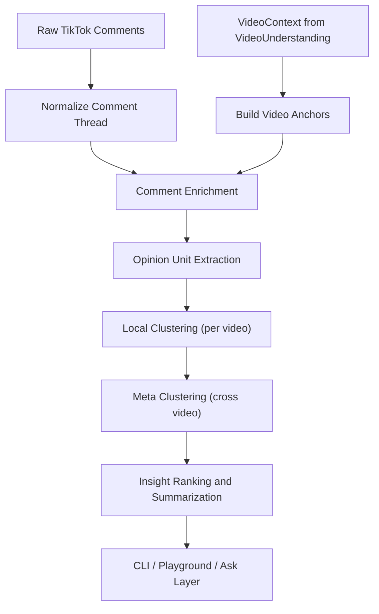

# Comment Enrichment and Opinion Clustering Design

## Status

Design document for the intended comment-analysis hierarchy.

The current repo implementation is documented in:

- `docs/COMMENT_ANALYSIS_IMPLEMENTATION.md`

This file still defines the target logic for the next stage of the TikTok analysis pipeline after:

1. comment retrieval
2. video download and understanding

It does not assume the current placeholder implementation in `src/core/utils/CommentClustering.ts` is correct. The goal here is to define the right data model and processing hierarchy first.

---

## 1. Problem Statement

Raw TikTok comments are often too ambiguous to cluster directly.

Typical failure modes:

- comments refer to the video implicitly:
  - "that part"
  - "when she did that"
  - "same"
  - "this is insane"
- replies refer to parent comments rather than the video itself
- one comment can contain multiple opinions
- many comments are low-signal reactions, jokes, or spam
- semantically similar opinions can appear under different videos with different wording

If raw comments are embedded and clustered directly, the output will be noisy and hard to trust.

The correct order is:

1. preserve raw comments
2. enrich and ground them using video understanding and thread context
3. organize them hierarchically
4. filter and rank at the output layer

Core principle:

> Do not collapse "noise filtering" and "clustering" into the same step.
> The lower layers should optimize for recall.
> The output layer should optimize for precision.

---

## 2. Design Goals

### Primary goals

- resolve ambiguous references in comments using `VideoContext`
- preserve provenance from raw comment to enriched output
- support both single-video and cross-video opinion analysis
- produce clusters that are understandable, reviewable, and explainable
- support analyst workflows such as:
  - auto-organized cluster views
  - dimension-based browsing
  - summarization
  - ask-style querying

### Non-goals

- perfect moderation or spam detection in v1
- full causal inference about why a comment was written
- replacing raw comments with rewritten text
- forcing every comment into a high-confidence cluster

---

## 3. High-Level Pipeline



The key shift is that local and cross-video clustering should operate on grounded opinion units or cluster representations, not on raw comments alone.

---

## 4. Core Design Principles

### 4.1 Preserve raw data

Never overwrite the original comment text. Every derived field must keep a pointer back to:

- raw comment id
- video id
- parent comment id if present
- model version / prompt version used for enrichment

### 4.2 Ground before grouping

Comments should be linked to video anchors first, then grouped.

### 4.3 Hierarchical clustering beats one-shot clustering

The system should not place all comments from all videos into one flat clustering job. It should use:

1. per-video organization
2. per-video local clustering
3. cross-video meta clustering

### 4.4 LLMs should do semantic interpretation, not own the whole algorithm

Use LLMs for:

- coreference resolution
- comment rewriting
- opinion unit extraction
- cluster labeling
- cluster summarization

Use embeddings and deterministic logic for:

- nearest-neighbor similarity
- local grouping
- cross-video matching
- ranking
- thresholding

### 4.5 Output is a product surface, not just a model artifact

The system should support both:

- `auto` organization
- `selected dimensions`

This matches future analyst workflows such as CLI playgrounds and ask-driven exploration.

---

## 5. Canonical Objects

This design introduces a layered set of objects. Existing repo types such as `Comment` and `VideoContext` remain the raw inputs.

### 5.1 Existing inputs

#### `Comment`

Current normalized repo object:

- `id`
- `author`
- `text`
- `timestamp`
- `likes`
- `replies`
- optional engagement metrics

#### `VideoContext`

Already produced by `VideoUnderstanding`:

- `mainTopic`
- `summary`
- `keyEntities`
- `timeline`
- `keyMoments`
- `implicitContext`
- `transcript`
- `visualText`
- `audioTrack`
- `callsToAction`
- `emotionalArc`
- `controversialMoments`

### 5.2 New derived objects

#### `VideoAnchor`

Compact unit of video-grounding evidence derived from `VideoContext`.

Suggested fields:

```ts
type VideoAnchorType =
  | 'moment'
  | 'timeline_segment'
  | 'entity'
  | 'spoken_quote'
  | 'visual_text'
  | 'cta'
  | 'controversy'
  | 'global_video';

interface VideoAnchor {
  anchorId: string;
  videoId: string;
  type: VideoAnchorType;
  label: string;
  description: string;
  timestampStart?: string;
  timestampEnd?: string;
  sourceField:
    | 'keyMoments'
    | 'timeline'
    | 'keyEntities'
    | 'transcript'
    | 'visualText'
    | 'callsToAction'
    | 'controversialMoments'
    | 'summary';
}
```

Purpose:

- turn the `VideoContext` object into addressable anchors
- make grounding explicit and reviewable
- provide coarse buckets for local clustering

#### `EnrichedComment`

Comment plus grounding, rewrite, and thread-awareness.

```ts
interface EnrichedComment {
  commentId: string;
  videoId: string;
  parentCommentId?: string;
  threadRootId?: string;

  rawText: string;
  resolvedText: string;
  rewriteApplied: boolean;

  targetType: 'video' | 'parent_comment' | 'thread' | 'other' | 'unclear';
  language?: string;

  anchorRefs: Array<{
    anchorId: string;
    role: 'primary' | 'secondary';
    confidence: number;
  }>;

  groundingConfidence: number;
  ambiguityFlags: string[];

  commentIntent:
    | 'reaction'
    | 'praise'
    | 'criticism'
    | 'question'
    | 'advice'
    | 'correction'
    | 'agreement'
    | 'disagreement'
    | 'joke'
    | 'meta'
    | 'spam'
    | 'other';

  engagement: {
    likes: number;
    replies: number;
    weightedScore: number;
  };

  provenance: {
    enrichmentModel: string;
    promptVersion: string;
    createdAt: string;
  };
}
```

#### `OpinionUnit`

The atomic semantic item to cluster. One comment can produce multiple opinion units.

Example:

- "I love the recipe but the room-temp advice is unsafe"

Should yield two units, not one mixed unit.

```ts
interface OpinionUnit {
  opinionUnitId: string;
  commentId: string;
  videoId: string;

  rawSpan?: string;
  normalizedText: string;

  aboutness: {
    anchorIds: string[];
    aspectKey: string;
    aspectLabel: string;
  };

  stance:
    | 'positive'
    | 'negative'
    | 'mixed'
    | 'question'
    | 'request'
    | 'observation'
    | 'humor'
    | 'other';

  intent:
    | 'feedback'
    | 'advice'
    | 'confusion'
    | 'agreement'
    | 'disagreement'
    | 'information_request'
    | 'joke'
    | 'other';

  evidenceSource: Array<'video' | 'parent_comment' | 'thread_context'>;
  groundingConfidence: number;
  semanticDensity: number;
  noiseFlags: string[];

  authorId: string;
  engagementScore: number;
}
```

#### `LocalCluster`

Cluster of related opinion units within one video.

```ts
interface LocalCluster {
  localClusterId: string;
  videoId: string;

  primaryAspectKey: string;
  primaryAspectLabel: string;
  anchorIds: string[];

  stanceProfile: {
    dominant: string;
    distribution: Record<string, number>;
  };

  unitIds: string[];
  commentIds: string[];

  size: number;
  uniqueAuthors: number;
  totalEngagement: number;
  replyDepthScore: number;
  averageGroundingConfidence: number;

  clusterType:
    | 'opinion'
    | 'question'
    | 'humor'
    | 'reaction_only'
    | 'spam'
    | 'off_topic'
    | 'mixed_noise';

  label: string;
  summary: string;
  representativeCommentIds: string[];
}
```

#### `MetaCluster`

Cross-video grouping of related local clusters.

```ts
interface MetaCluster {
  metaClusterId: string;

  canonicalTheme: string;
  canonicalAspectKey: string;
  canonicalStance: string;

  localClusterIds: string[];
  videoIds: string[];

  coverage: {
    videos: number;
    comments: number;
    uniqueAuthors: number;
  };

  importanceScore: number;
  recurrenceScore: number;
  controversyScore: number;
  confidence: number;

  label: string;
  summary: string;
  representativeCommentIds: string[];
}
```

#### `Insight`

Final output object for the analyst or ask layer.

```ts
interface Insight {
  insightId: string;
  scope: 'single_video' | 'cross_video';
  clusterIds: string[];

  title: string;
  description: string;
  whyItMatters: string;

  supportingVideoIds: string[];
  supportingCommentIds: string[];
  supportingAnchors: string[];

  importanceScore: number;
  confidence: number;
}
```

---

## 6. Stage A: Build Video Anchors

`VideoContext` is useful, but it is too large and too free-form to use directly for comment grounding. The first derived step should convert it into a compact anchor catalog.

### 6.1 Anchor types

Generate anchors from:

- `keyMoments`
- `timeline`
- `keyEntities`
- `transcript` excerpts
- `visualText`
- `callsToAction`
- `controversialMoments`
- one `global_video` anchor for comments about the whole video

### 6.2 Anchor construction rules

#### `moment` anchors

Derived from `keyMoments` and `controversialMoments`.

Good for:

- "that part"
- "when she dropped it"
- "the moment he said..."

#### `spoken_quote` anchors

Derived from the transcript excerpt.

Keep only lines that are:

- quotable
- instructional
- controversial
- emotionally important
- likely to be repeated in comments

#### `visual_text` anchors

Derived from deduplicated visual text.

Good for:

- recipe step cards
- ingredient labels
- warning overlays
- claims on screen

#### `entity` anchors

Derived from `keyEntities`.

Good for pronouns:

- she
- he
- it
- they

### 6.3 Anchor granularity

Keep anchors compact and interpretable.

Bad anchor:

- "entire long transcript paragraph"

Good anchor:

- "0:42 - creator says not to move the steak once it hits the pan"

---

## 7. Stage B: Comment Enrichment

This stage transforms a raw comment into a grounded semantic object.

### 7.1 Inputs

- raw comment
- optional parent comment
- optional thread root
- video anchor catalog
- video context summary

### 7.2 Outputs

- `EnrichedComment`
- zero to many `OpinionUnit`s

### 7.3 Enrichment tasks

#### Task 1: Thread normalization

Resolve:

- parent-child relationships
- thread root
- reply depth
- whether the comment primarily targets:
  - the video
  - the parent comment
  - the broader thread

#### Task 2: Grounding and coreference resolution

Map references such as:

- "that part"
- "when she did that"
- "this"
- "same"
- "exactly"

to:

- a video anchor
- a parent-comment claim
- both

#### Task 3: Comment rewriting

Generate `resolvedText` only when the grounding confidence is high enough.

Rules:

- keep `rawText` unchanged
- do not invent detail
- if confidence is low, preserve ambiguity
- explicitly attach anchor references used in the rewrite

Example:

- raw:
  - "that part was hilarious"
- resolved:
  - "the moment at 0:23 when the creator dropped the phone was hilarious"

Counter-example:

- raw:
  - "same"
- if unclear whether it refers to the video or parent comment, do not rewrite into a specific claim

#### Task 4: Opinion unit extraction

A single comment may contain:

- one opinion
- multiple opinions
- a question plus a reaction
- a joke plus a criticism

The enrichment stage should split multi-opinion comments into separate `OpinionUnit`s when possible.

#### Task 5: Intent and stance typing

Assign:

- stance
- intent
- semantic density
- noise flags

### 7.4 Confidence and ambiguity handling

Every enriched comment should carry:

- `groundingConfidence`
- `ambiguityFlags`

Suggested ambiguity flags:

- `unclear_pronoun`
- `unclear_time_reference`
- `reply_target_ambiguous`
- `video_anchor_not_found`
- `multi_interpretation_possible`

### 7.5 Why this stage matters

This is the main defense against bad clustering.

Without enrichment:

- "same", "facts", and "lol" become meaningless vectors
- replies get mixed with video-level opinions
- comments about a creator and comments about a cooking instruction collapse together

---

## 8. Stage C: Opinion Unit Extraction Strategy

This stage is logically part of enrichment, but it deserves separate design attention because it determines clustering quality.

### 8.1 Why cluster opinion units instead of comments

Raw comments are often too coarse.

One comment may say:

> "Her knife skills are impressive but telling people to leave steak out that long is risky."

This should create:

1. a positive unit about knife skills
2. a negative unit about food safety advice

If the entire comment is treated as one item, it cannot be cleanly clustered.

### 8.2 Recommended extraction behavior

- allow `0..3` units per comment in v1
- default to 1 unit for simple comments
- split only when there is clear semantic separation
- keep a back-pointer to the original comment

### 8.3 Suggested fields for each unit

- normalized opinion text
- aspect key
- aspect label
- stance
- intent
- anchor ids
- confidence
- engagement score
- semantic density

### 8.4 Semantic density

This is useful for separating meaningful comments from noise.

High semantic density:

- "The creator's claim that you can leave steak out for an hour feels unsafe."

Low semantic density:

- "nah"
- "lol"
- "same"

Low-density units should still be stored, but they should not dominate cluster formation.

---

## 9. Stage D: Local Clustering Within a Video

This is the first actual clustering layer.

The goal is:

- organize all opinion units for one video into coherent local topics
- separate different subjects in the same video
- capture local stance variation

### 9.1 Why local clustering must come first

Many comments only make sense inside their source video.

For example:

- "the second flip"
- "that ending"
- "when she walked out"

These should not be compared globally before they are locally grounded.

### 9.2 Local clustering levels

Local clustering should happen in two passes.

#### Pass 1: Coarse grouping by aboutness

Group opinion units into coarse buckets using:

- primary anchor id
- aspect key
- entity reference
- global video scope

Examples:

- comments about the room-temperature advice
- comments about the knife grip
- comments about the creator's personality
- comments about the ending joke

This pass should be recall-heavy and tolerant of overlap.

#### Pass 2: Fine clustering by stance and semantic similarity

Within each coarse bucket, cluster by:

- stance
- intent
- embedding similarity
- thread cues

Example:

Inside the bucket "room-temperature steak advice":

- cluster A: people agreeing it is correct
- cluster B: people saying it is unsafe
- cluster C: people asking clarifying questions
- cluster D: jokes and exaggerated reactions

### 9.3 Recommended algorithm shape

Do not use plain k-means as the main local clustering algorithm.

Reasons:

- number of clusters is unknown
- comment distributions are uneven
- noise comments are common
- cluster sizes are highly imbalanced

Preferred order:

1. deterministic coarse bucketing by anchor/aspect
2. embedding-based agglomerative clustering or HDBSCAN within each bucket
3. post-processing split/merge rules

If HDBSCAN is not convenient in the TypeScript stack, agglomerative clustering with conservative merge thresholds is a better fit than k-means.

### 9.4 Split rules

Split a local cluster when:

- stance is mixed in a way that blurs the theme
- one cluster combines questions and opinions
- the comments refer to different anchors
- reply chains create a sub-theme with clear semantic independence

### 9.5 Merge rules

Merge local clusters when:

- same aspect key
- same stance profile
- high centroid similarity
- representative comments are near-duplicates

### 9.6 Required local cluster outputs

Each local cluster should expose:

- label
- summary
- aspect
- stance profile
- representative comments
- cluster type
- importance score

### 9.7 What counts as a local cluster

Good local cluster:

- "Viewers criticize the creator's claim that steak can sit out for an hour"

Bad local cluster:

- "general reactions"

unless it is explicitly labeled `reaction_only`.

---

## 10. Stage E: Cross-Video Meta Clustering

Cross-video clustering should not run on raw comments.

It should run on:

- local cluster summaries
- local cluster centroids
- aspect descriptors
- stance profiles
- representative comments

### 10.1 Why cluster local clusters instead of comments

Cross-video analysis should discover repeated themes such as:

- "audience distrusts this safety advice"
- "viewers praise the creator's skill but criticize teaching quality"
- "commenters repeatedly ask for measurements"

These themes are more stable at the local-cluster level than at the raw-comment level.

### 10.2 Candidate generation

Only compare local clusters that are plausibly comparable.

Candidate matching should consider:

- shared aspect key or nearby aspect embedding
- same or compatible stance
- similar cluster labels or summaries
- same content genre if available

This prevents meaningless comparisons such as:

- a joke about the creator's dog
- vs
- criticism of cooking safety in another video

### 10.3 Meta cluster dimensions

Meta clusters should organize around a canonical issue or viewpoint, not around literal wording.

Examples:

- `food_safety/room_temp_duration/negative`
- `creator_personality/authenticity/positive`
- `instruction_quality/missing_measurements/question`
- `knife_skill/impressive/positive`

### 10.4 Required fields

Each meta cluster should store:

- canonical theme
- canonical aspect key
- canonical stance
- supporting local clusters
- supporting videos
- coverage and recurrence metrics
- representative comments from multiple videos

### 10.5 Why this layer matters

Without meta clustering, the system can summarize one video well but cannot answer:

- what opinions repeat across multiple videos
- which concerns recur in a category
- which reactions are isolated vs recurring

---

## 11. Noise, Low-Signal, and "Useless" Comments

The system should not hard-delete low-signal comments during clustering.

Instead, it should classify them and lower their importance.

### 11.1 Low-signal patterns

Examples:

- pure emoji
- "lol"
- "same"
- tag-only comments
- giveaway spam
- copied promotional text

### 11.2 Handling policy

At the comment or opinion-unit level:

- keep them
- mark them with `noiseFlags`
- lower their semantic density

At the local-cluster level:

- allow dedicated cluster types such as:
  - `reaction_only`
  - `spam`
  - `mixed_noise`

At the output layer:

- suppress low-value clusters by default
- allow analysts to include them when needed

### 11.3 Important exception

A low-semantic-density reaction can still matter if it appears at scale.

Example:

- thousands of short comments expressing disgust, shock, or approval

This should be retained as a valid "mass reaction" signal, but labeled clearly rather than mixed with reasoned feedback.

---

## 12. Engagement Weighting

Engagement should influence ranking, not dominate semantic grouping.

### 12.1 Comment-level engagement

Use engagement to influence:

- representativeness
- output ranking
- exemplar selection

Do not use engagement as the primary signal for assigning semantic meaning.

### 12.2 Suggested comment-level score

Example shape:

```ts
commentEngagementScore =
  1.0 * log1p(likes) +
  1.5 * log1p(replyCount) +
  1.2 * log1p(shares || 0) +
  0.3 * log1p(views || 0)
```

Optional:

- apply a mild time-decay factor only if freshness matters for the product surface

### 12.3 Local cluster importance score

Local cluster importance should combine:

- comment volume
- unique authors
- aggregated engagement
- reply depth
- average grounding confidence
- semantic density
- stance intensity

Suggested normalized formula:

```ts
localClusterImportance =
  0.20 * norm(commentCount) +
  0.20 * norm(uniqueAuthors) +
  0.20 * norm(totalEngagement) +
  0.15 * norm(replyDepthScore) +
  0.15 * norm(avgGroundingConfidence) +
  0.10 * norm(avgSemanticDensity)
```

### 12.4 Meta cluster importance score

Meta clusters should add cross-video recurrence:

```ts
metaClusterImportance =
  0.25 * norm(videoCoverage) +
  0.20 * norm(totalComments) +
  0.20 * norm(uniqueAuthors) +
  0.15 * norm(totalEngagement) +
  0.10 * norm(avgGroundingConfidence) +
  0.10 * norm(controversyOrPolarization)
```

### 12.5 Polarization / controversy

A cluster can be important even if engagement is not the highest, if:

- it has strong disagreement
- it attracts reply chains
- it recurs across multiple videos

This is especially relevant for criticism, corrections, and safety concerns.

---

## 13. Representative Comment Selection

Cluster summaries should not just show the top-liked comments.

Each important cluster should expose a small balanced set of examples.

### 13.1 Recommended exemplar types

For each cluster, select:

1. one prototype comment
   - highest semantic centrality to the cluster centroid
2. one high-engagement comment
   - highest engagement among high-confidence members
3. one edge or dissenting comment if the cluster is mixed
4. optionally one reply-chain example if the thread structure is important

### 13.2 Do not allocate examples strictly by cluster size

Bad rule:

- "a 30 percent cluster gets 30 percent of all examples"

Better rule:

- fixed small number of exemplars per important cluster
- rank important clusters globally
- cap the total display budget

This produces a much better analyst view.

---

## 14. Analyst Dimensions and Ask Layer

The future UI or CLI should not expose only one organization mode.

It should support:

- `auto`
- `selected dimensions`

### 14.1 Auto mode

Default organization:

1. group by aboutness
2. split by stance
3. rank by importance

This should work for most first-pass exploration.

### 14.2 Selected dimensions

Analysts should be able to organize or query by:

- aboutness
  - moment
  - feature
  - entity
  - claim
- stance
  - positive
  - negative
  - mixed
  - question
- intent
  - praise
  - criticism
  - advice
  - confusion
  - humor
- evidence source
  - video
  - parent comment
  - thread context
- scope
  - single video
  - cross video

### 14.3 Ask layer behavior

`ask` should query against:

- enriched comments
- opinion units
- local clusters
- meta clusters

not raw comments alone.

Example ask queries:

- "What are viewers criticizing most across these five videos?"
- "Which clusters are mostly useless reactions?"
- "Show questions about missing measurements."
- "What concerns recur across multiple videos?"

---

## 15. Recommended Implementation Phases

### Phase 1: Foundation

Build:

- `VideoAnchor`
- `EnrichedComment`
- comment grounding
- rewrite with provenance and confidence

Output target:

- a stable enrichment JSON contract

### Phase 2: Opinion units and local clustering

Build:

- `OpinionUnit`
- aboutness bucketing
- within-video clustering
- local cluster labels and summaries

Output target:

- reliable per-video cluster organization

### Phase 3: Cross-video meta clustering

Build:

- local cluster signatures
- meta cluster matching
- recurrence and importance scores

Output target:

- repeated patterns across videos

### Phase 4: Ask and product surfaces

Build:

- auto organization
- dimension-based filtering
- final insight generation
- CLI / playground integration

---

## 16. Minimal JSON Contracts for v1

If implementation needs to stay simple at first, the minimum viable contracts should still include:

### 16.1 Enriched comment

```json
{
  "commentId": "c1",
  "videoId": "v1",
  "rawText": "that part was hilarious",
  "resolvedText": "the moment at 0:23 when the creator dropped the phone was hilarious",
  "rewriteApplied": true,
  "targetType": "video",
  "anchorRefs": [
    {
      "anchorId": "v1_moment_023_drop_phone",
      "role": "primary",
      "confidence": 0.93
    }
  ],
  "groundingConfidence": 0.93,
  "commentIntent": "reaction"
}
```

### 16.2 Local cluster

```json
{
  "localClusterId": "v1_lc_04",
  "videoId": "v1",
  "primaryAspectKey": "food_safety.room_temp_duration",
  "primaryAspectLabel": "Leaving steak out at room temperature for too long",
  "anchorIds": ["v1_quote_room_temp_hour"],
  "clusterType": "opinion",
  "label": "Viewers criticize the food safety advice",
  "summary": "Most comments in this cluster argue that the room-temperature guidance is unsafe or misleading.",
  "size": 24,
  "uniqueAuthors": 21,
  "representativeCommentIds": ["c9", "c13", "c41"]
}
```

### 16.3 Meta cluster

```json
{
  "metaClusterId": "mc_02",
  "canonicalTheme": "Recurring food-safety criticism",
  "canonicalAspectKey": "food_safety.room_temp_duration",
  "canonicalStance": "negative",
  "videoIds": ["v1", "v3", "v5"],
  "localClusterIds": ["v1_lc_04", "v3_lc_02", "v5_lc_05"],
  "importanceScore": 0.87,
  "summary": "Across multiple videos, viewers repeatedly challenge the creator's advice about leaving meat out too long."
}
```

---

## 17. Key Design Decisions

### Decision 1

Do not cluster raw comments across videos in one pass.

### Decision 2

Introduce `OpinionUnit` as the true semantic atom, even if the first implementation uses one unit per comment most of the time.

### Decision 3

Use `VideoAnchor`s as the bridge between `VideoContext` and comments.

### Decision 4

Treat engagement as a ranking multiplier, not as the source of semantic meaning.

### Decision 5

Keep low-signal comments in storage, but suppress them by default in analyst-facing outputs.

### Decision 6

Support both:

- auto organization
- analyst-selected dimensions

---

## 18. Open Risks

### Risk 1: Over-rewriting ambiguous comments

If the enrichment stage rewrites low-confidence comments too aggressively, downstream clustering will be confidently wrong.

Mitigation:

- require confidence thresholds
- keep raw text and rewrite side by side
- log ambiguity flags

### Risk 2: Over-fragmenting comments into too many units

If unit extraction splits too aggressively, clusters become brittle.

Mitigation:

- cap units per comment
- split only on clear semantic boundaries

### Risk 3: Meta clusters become too abstract

If cross-video clustering loses anchor-level specificity, analysts will not trust the results.

Mitigation:

- keep representative local clusters and anchor references attached
- expose supporting comments from multiple videos

### Risk 4: Noise dominates surface area

If reaction-only comments dominate counts, the analyst view becomes shallow.

Mitigation:

- separate `reaction_only` clusters
- rank by importance, not by raw count alone

---

## 19. Recommended Next Deliverables

The next implementation-oriented artifacts should be:

1. a TypeScript schema file for:
   - `VideoAnchor`
   - `EnrichedComment`
   - `OpinionUnit`
   - `LocalCluster`
   - `MetaCluster`
2. a `CommentEnricher` contract and prompt specification
3. a deterministic local clustering plan
4. a ranking and summarization contract for the ask layer

---

## 20. Bottom Line

The correct architecture is:

1. `VideoContext` becomes a compact anchor catalog
2. comments are enriched and grounded against video anchors and thread context
3. comments are split into opinion units when needed
4. opinion units are clustered locally within each video
5. local clusters are clustered again across videos
6. low-signal material is retained but suppressed by default
7. engagement affects ranking and cluster importance, not semantic meaning
8. the final product layer supports both automatic organization and analyst-selected dimensions

This gives the repo a path from raw TikTok comments to an explainable opinion intelligence layer rather than a flat embedding demo.
